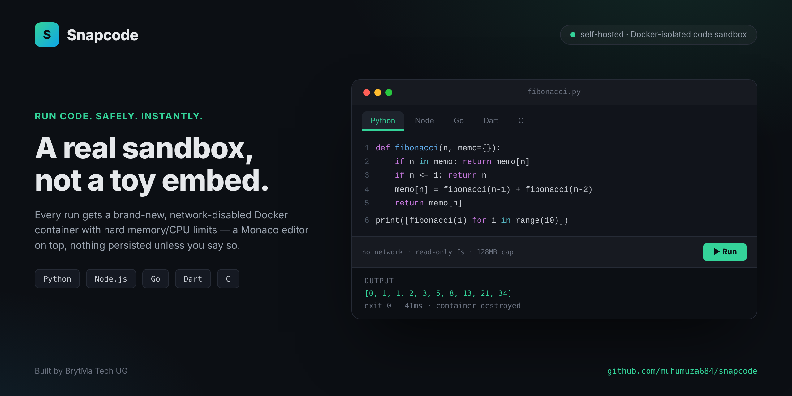

# Snapcode

A self-hosted code sandbox that runs untrusted code in isolated, resource-limited
Docker containers, with a minimal Monaco-based editor in the browser. Built by
BrytMa Tech UG.

Write code in Python, Node.js, Dart, Go, or C — click Run — see real stdout/stderr,
exit code, and timing, with no risk to the host machine.


---

## Why Snapcode

Most "run code in the browser" tools are either a hosted SaaS you don't control,
or a toy that isn't actually isolated. Snapcode is the middle ground: you run it
yourself, on your own machine or server, and every single run gets a brand-new
container with network disabled, a read-only filesystem, dropped Linux
capabilities, and hard memory/CPU/time limits. Nothing persists between runs
unless you explicitly save it.

## Features

- **5 languages** — Python, Node.js, Dart, Go, C — each with their own
  pre-built, pre-warmed Docker image.
- **Real isolation** — no network access at runtime, read-only root filesystem
  (only `/tmp` is writable, and non-executable except for Go's narrow,
  deliberate exception), all Linux capabilities dropped, 64-process limit
  (fork-bomb protection), non-root execution.
- **Resource limits** — memory/CPU caps per run, with OOM detection and a
  plain-English message instead of a silent failure.
- **Timeouts** — 8 seconds for most languages; Go gets 25 seconds since its
  standard library has to compile fresh on every run (no warm build cache,
  by design — see "Known limitations").
- **Pre-warmed pool** — Python and Node keep idle containers ready so most
  runs skip the ~1–3s container-creation cost.
- **stdin support** — feed input to your program, not just read its output.
- **Save & share** — click Save to get a shareable `?id=` link that reloads
  the exact snippet later.
- **Examples library** — a dropdown of working examples per language
  (hello world, stdin handling, pre-installed packages, isolation checks).
- **Friendlier errors** — common failures (missing package, syntax error,
  blocked network call, permission denied) get a plain-English explanation
  on top of the raw error, never instead of it.
- **Abuse protection** — per-IP rate limiting, escalating temporary bans for
  repeat offenders, a global concurrency cap, and optional bearer-token auth.
- **Observability** — structured run logs and a `GET /stats` endpoint for
  aggregate counts (total runs, by language, timeouts, OOM kills, pool sizes).

## Quickstart

### Prerequisites

- Docker installed and running (Docker Desktop on Windows/Mac, or Docker
  Engine on Linux)
- Node.js 18+ installed (for the orchestrator server)

### One-command setup

```bash
# Windows
.\setup.ps1

# Mac/Linux
./setup.sh
```

This builds all the sandbox images and installs server dependencies.

### Manual setup

```bash
# 1. Build the sandbox images
docker build -t sandbox-python -f docker/python.Dockerfile docker/
docker build -t sandbox-node   -f docker/node.Dockerfile   docker/
docker build -t sandbox-dart   -f docker/dart.Dockerfile   docker/
docker build -t sandbox-go     -f docker/go.Dockerfile     docker/
docker build -t sandbox-c      -f docker/c.Dockerfile      docker/

# 2. Install server dependencies
cd server
npm install

# 3. Run the server
npm start
```

Open `http://localhost:4000`.

## How it works

Each Run:
1. Writes your code to a temp file on the host.
2. Starts a brand-new container from the matching language image, with
   *only that file* bind-mounted in read-only, network disabled, and
   memory/CPU limits set by a simple heuristic (heavier limits if the code
   imports something like numpy/pandas/torch).
3. Feeds any stdin you provided, then waits for the container to finish (or
   kills it after the language's timeout).
4. Reads back stdout/stderr, exit code, and timing; checks whether it was
   OOM-killed; removes the container and temp file.

Nothing persists between runs unless you explicitly click **Save**.

## Verifying it's a real sandbox, not a dummy

Re-run these any time you change a Dockerfile or `server/index.js`, to
confirm isolation still actually holds — or just run
`node tests/verify-sandbox.js` with the server running, which automates
all of them:

- **Network is blocked** — `urllib.request.urlopen(...)` (Python) should
  raise a connection error, not succeed.
- **Filesystem is isolated** — `os.listdir("/")` should show a container's
  root, never your host's real folders.
- **Memory limit is enforced** — allocating ~300MB against the 128MB
  default cap should crash the run (`oomKilled: true`).
- **Timeout is enforced** — an infinite loop should stop after the
  language's timeout (`timedOut: true`).
- **Runs don't share state** — writing a file in one run, then checking
  for it in the next, should show it's gone.

## Testing

```bash
node tests/verify-sandbox.js      # isolation checks (network/memory/timeout/persistence)
node tests/concurrency-test.js    # confirms concurrent runs don't block each other
node tests/security-check.js      # hardening checks (read-only fs, capabilities, PID limit, non-root)
```

## Environment variables (all optional)

| Variable | Default | Purpose |
|---|---|---|
| `PORT` | `4000` | Server port |
| `POOL_ENABLED` | `true` | Turn the pre-warmed pool on/off |
| `POOL_SIZE` | `2` | Idle containers kept per pool-eligible language |
| `RATE_LIMIT_MAX` | `20` | Max runs per IP per minute |
| `MAX_CONCURRENT_RUNS` | `10` | Max runs executing at once, across all IPs |
| `SANDBOX_TOKEN` | unset | If set, required as a Bearer token on `/run` and `/save` |
| `BAN_THRESHOLD` | `3` | Rate-limit violations before a temporary IP ban |
| `BAN_DURATION_MINUTES` | `15` | How long a ban lasts |
| `SANDBOX_HTTPS` | `false` | Set `true` to also serve HTTPS with a self-signed cert |
| `HTTPS_PORT` | `4443` | Port for the HTTPS listener, when enabled |

## Known limitations (by design, for now)

- **No pre-warmed pool for every language** — only Python/Node are
  pool-eligible; Go and heavy-package runs always cold-start.
- **Network is always off** — no API mocking yet.
- **Persistence is a single JSON file** — fine for personal/small use, not
  built for concurrent writers or large scale.
- **Rate limiting/bans are local to one process** — no cross-instance
  coordination; a real "at scale" deployment would need a shared store
  like Redis.
- **Self-signed HTTPS shows a browser warning** — real browser trust needs
  a certificate from a real domain (see `DEPLOY.md`).
- **Not independently security-audited** — the automated checks in
  `tests/security-check.js` catch regressions, not a real penetration
  test. Don't run untrusted strangers' code on this without a real audit
  first if that's ever the plan.

## Project structure

```
snapcode/
├── docker/            # one Dockerfile per supported language
├── frontend/          # Monaco-based editor UI (index.html + assets)
├── server/            # Node.js orchestrator (index.js) — spins up containers, runs code
├── tests/             # isolation, concurrency, and security self-checks
├── setup.ps1/.sh       # one-command build + install
├── DEPLOY.md          # how to put this on a public server (Oracle Cloud guide)
└── README.md
```

## Build guide — where to pick this up next time

1. Clone the repo: `git clone https://github.com/muhumuza684/snapcode.git`
2. Run `.\setup.ps1` (or `./setup.sh`) to build images and install deps.
3. `cd server && npm start`, open `http://localhost:4000`.
4. To add a new language: add a `docker/<lang>.Dockerfile`, add it to the
   language list/examples in `frontend/index.html`, and add its run command
   + any timeout override in `server/index.js`.
5. To change resource limits, rate limits, or auth: see the environment
   variables table above — most tuning doesn't need a code change.
6. To deploy publicly: see `DEPLOY.md`.

## License & attribution

Built by BrytMa Tech UG.


